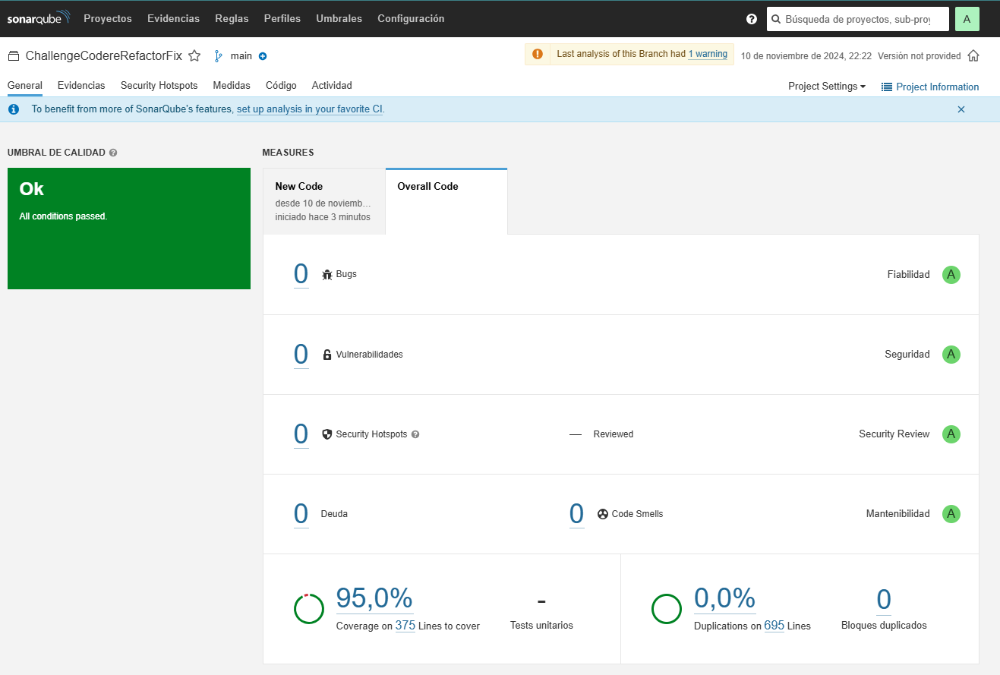

# ⛽️ ChallengeCodereRefactor Project

&#x20;

## 💑 Introduction

Welcome to the **ChallengeCodereRefactor Project**! This project is a web application built with **ASP.NET Core**, a popular framework for building web applications. The development of this project follows the **Domain-Driven Design (DDD)** approach, which is a method for designing and building software that reflects complex business domains by breaking them down into different layers.

The project is designed to manage TV shows, allowing users to perform CRUD operations (Create, Read, Update, Delete) on TV shows, networks, genres, and ratings. Additionally, it can fetch data from an external API to ensure that the information is always up to date. This guide will walk you through understanding, setting up, and running the project.

## ✨ Features

- **CRUD Operations**: Users can add, view, update, and delete TV shows, networks, genres, and ratings.
- **External API Integration**: The project is integrated with an external API to fetch and store TV show data.
- **Swagger Documentation**: Provides an interactive interface for testing and exploring the API.
- **Unit & Integration Tests**: Ensures the code is reliable and functions correctly.
- **Entity Framework Core**: Handles interactions with the database efficiently.

## 🫠 Architecture & Patterns

This project uses **Domain-Driven Design (DDD)**, which divides the software into different layers to make the code more maintainable and scalable. The idea behind DDD is to model the software closely to the business logic, making it easier for developers to understand and modify.

### 📦 Layers Explained

1. **Domain Layer**:

   - This layer contains the core business logic and domain entities, which represent real-world concepts like TV shows and networks.
   - **Entities**: These are objects that have a unique identity within the system, such as a `Show` or `Network`.
   - **Repository Interfaces**: These are contracts that define how data access should be handled but do not provide the actual implementation. This ensures a clear separation of concerns.

2. **Application Layer**:

   - This layer manages the application's logic and use cases. It acts as the intermediary between the domain layer and the infrastructure.
   - **DTOs (Data Transfer Objects)**: These are simplified objects used to transfer data between layers without exposing internal structures.
   - **Service Interfaces**: Define the methods that need to be implemented by the application services.

3. **Infrastructure Layer**:

   - This layer deals with external systems and technical details. It includes implementations of the repository interfaces, integration with databases, and services that interact with external APIs.
   - **Persistence**: Uses **Entity Framework Core** for managing database operations such as creating, reading, updating, and deleting records.

4. **UI Layer**:

   - This is where the API controllers are located. It handles HTTP requests and sends responses back to the client. The Swagger integration in this layer allows users to interact with the API via a web-based interface.

5. **Tests Layer**:

   - This includes both unit tests and integration tests to verify the functionality of individual components and their interactions.
   - **Unit Tests**: Focus on testing specific components in isolation.
   - **Integration Tests**: Ensure that different parts of the application work together as expected.

### 🔄 Design Patterns Used

- **Repository Pattern**: Used to abstract data access logic, making it easier to change the data source without affecting other parts of the application.
- **Dependency Injection**: Promotes loose coupling by injecting dependencies into classes, which makes testing and maintenance easier.
- **DTO Pattern**: Helps transfer data between different layers of the application without exposing internal data structures.

## 🚀 Getting Started

Here is a step-by-step guide to set up the project on your local machine.

### 🔧 Prerequisites

Before setting up the project, make sure you have the following installed:

- **[Visual Studio 2022](https://visualstudio.microsoft.com/vs/)** or a compatible integrated development environment (IDE) with .NET Core development tools.
- **[.NET 6.0 SDK](https://dotnet.microsoft.com/download/dotnet/6.0)**: Required for building and running the application.
- **[SQL Server](https://www.microsoft.com/en-us/sql-server/sql-server-downloads)**: Used as the database for storing TV show data.
- **[Git](https://git-scm.com/downloads)**: Version control to clone the project repository.

### 📅 Installation

1. **Clone the Repository**
   Open your terminal or command prompt and run the following command to clone the project repository:

   ```bash
   git clone https://github.com/ezequielmm/ChallengeCodereRefactor.git
   ```

2. **Navigate to the Project Directory**
   Move into the project folder by running:

   ```bash
   cd Challenge
   ```

3. **Restore Dependencies**
   Restore the required dependencies using the command:

   ```bash
   dotnet restore
   ```

## 💄️ Database Setup

The project uses **Entity Framework Core** for database interactions. To set up the database, you need to create and apply migrations, which update the database schema based on changes in your models.

### 📜 Creating Migrations

Migrations help track changes made to the database schema over time. Run the following command to create an initial migration:

```bash
dotnet ef migrations add InitialCreate
```

### ⚒️ Applying Migrations

Apply the created migrations to update the database schema by running:

```bash
dotnet ef database update
```

## 🏃 Running the Project

You can run the project through **Visual Studio** or the **Command Line Interface (CLI)**.

### 💻 From Visual Studio

- Open the solution file `Challenge.sln`.
- Press `F5` to run with debugging or `Ctrl + F5` to run without debugging.

### 🔡 From Command Line

Navigate to the project directory:

```bash
cd src/Challenge
```

Run the project through Visual Studio 2022 by selecting and running the **IIS Express** profile.

## 🔤 Using Swagger

**Swagger** is an open-source tool that provides an interactive user interface for testing and exploring API endpoints. Access the Swagger UI by entering the following URLs in your web browser:

`https://localhost:44330/swagger/index.html`

or

`http://localhost:44330/swagger/index.html`

You can use Swagger to:

- View all available API endpoints.
- Test the endpoints by clicking on them and using the **"Try it out"** button.
- Enter any required API keys through the **"Authorize"** button for authentication.

## 🧪 Running Tests

Regularly running tests helps ensure that the code is reliable and performs as expected.

### 🔬 Unit Tests

Unit tests check the functionality of individual components:

```bash
cd src/Tests/ApplicationTests
dotnet test
```

### 🔍 Integration Tests

Integration tests verify that multiple components work together correctly:

```bash
cd src/Challege.Tests
dotnet test
```

## 📈 SonarQube Analysis Results




The project has achieved a code coverage of **95%** and has been graded **A** in terms of code quality. There are no **code smells**, bugs, vulnerabilities, or security hotspots, indicating that the code is well-written and secure.

## 📣 Contact

If you have questions or need assistance, please feel free to reach out:

- **Email**: [ezequielmora1986@gmail.com](mailto\:ezequielmora1986@gmail.com)
- **GitHub**: [@ezequielmm](https://github.com/ezequielmm)

